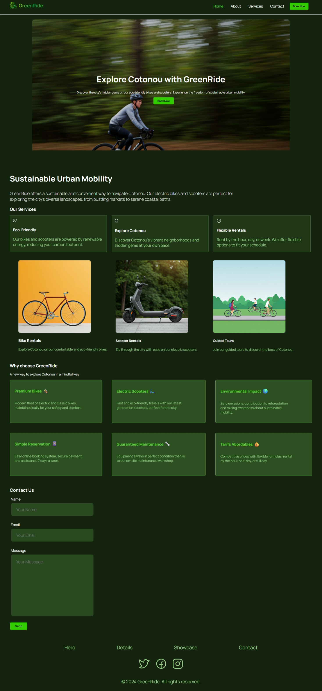
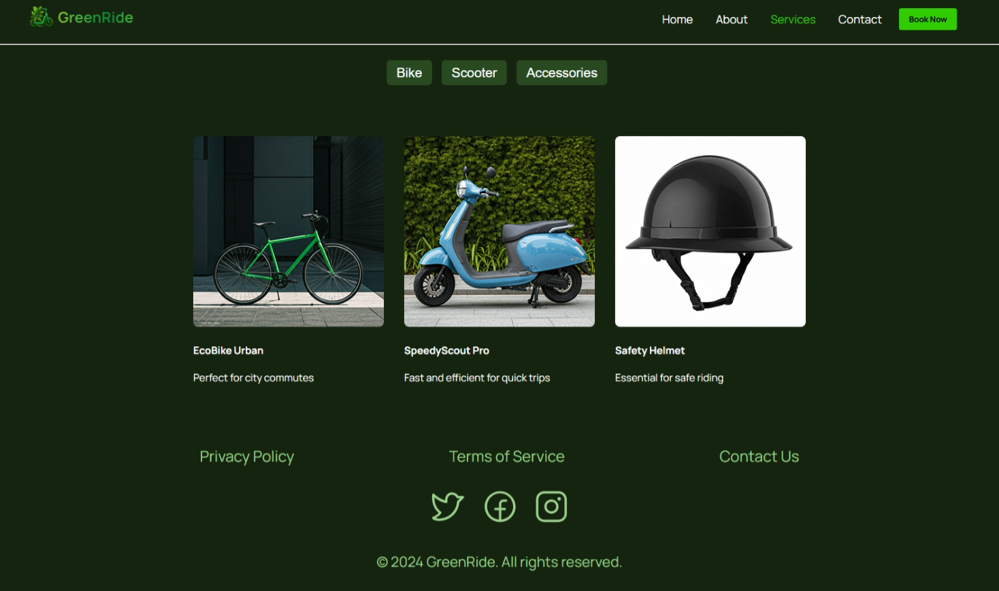
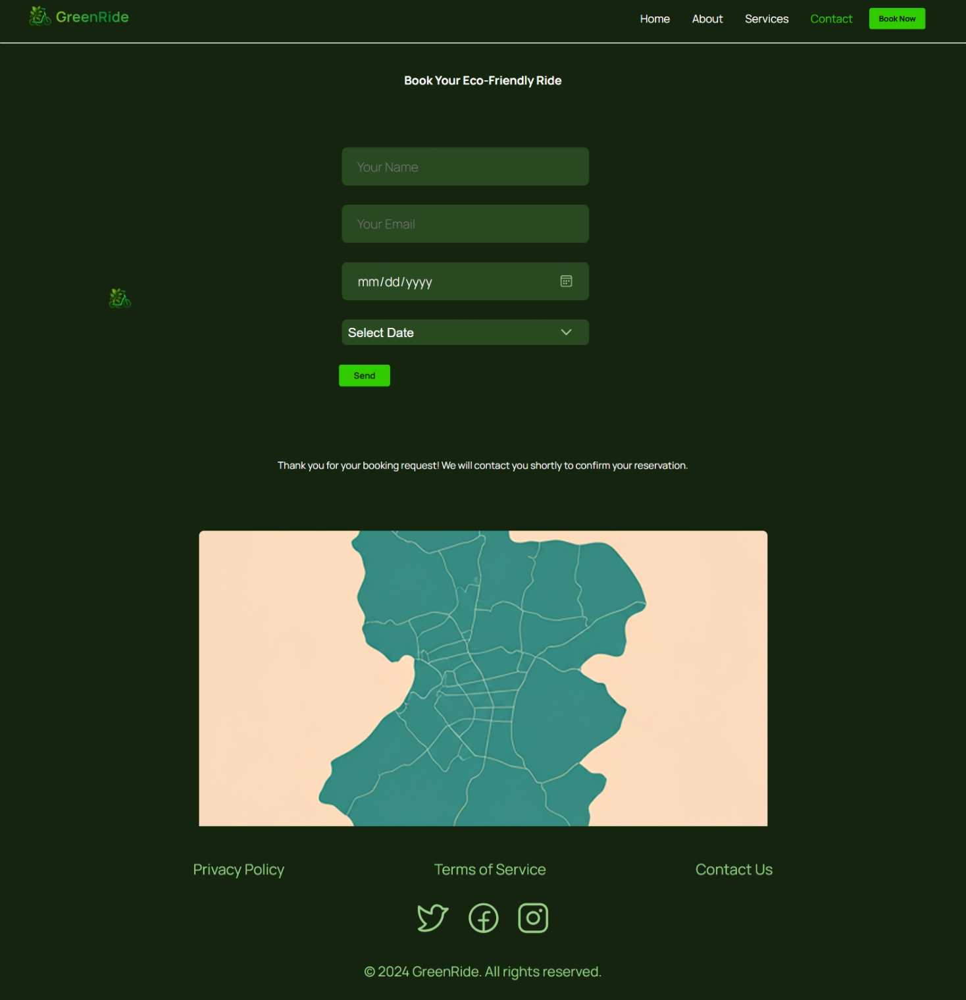
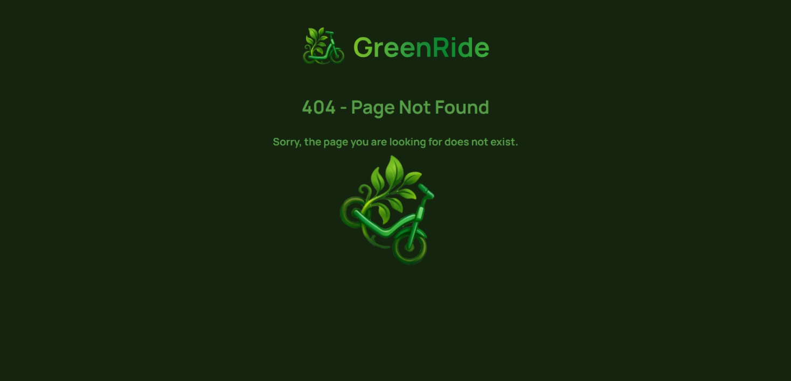

# 🌱 GreenRide

> Eco-friendly bike and scooter rental website for Cotonou, Benin.

GreenRide is a multi-page PHP website for a fictional urban mobility service. It features a product catalogue, booking form, sustainability page, and a custom 404 experience — all wrapped in a responsive dark-green design with scroll-driven animations.

---

## Table of contents

- [Live preview](#live-preview)
- [Project structure](#project-structure)
- [Pages](#pages)
- [Tech stack](#tech-stack)
- [Getting started](#getting-started)
  - [Docker (recommended)](#docker-recommended)
  - [Local PHP server](#local-php-server)
- [Configuration](#configuration)
- [Screenshots](#screenshots)
- [Roadmap](#roadmap)
- [License](#license)

---

## Live preview

> Add your deployed URL here once the project is hosted (e.g. Render, Railway, Fly.io).

---

## Project structure

```
GreenRide/
├── Dockerfile               # PHP 8.2 + Apache production image
└── src/                     # Apache document root
    ├── index.php            # Root redirect → /home
    ├── home.php             # Landing page
    ├── about.php            # Impact & sustainability page
    ├── services.php         # Product catalogue
    ├── contact.php          # Booking form
    ├── 404.php              # Custom error page
    ├── head.php             # Shared <head> partial
    ├── header.php           # Shared site header + navigation
    ├── footer.php           # Shared footer + loader teardown
    ├── loading.php          # Loading overlay partial
    ├── style.css            # Global stylesheet
    ├── script.js            # Scroll-driven scooter animation
    ├── script_rotate.js     # Bounce animation (404 + loading screens)
    ├── .htaccess            # Clean URLs + error routing
    ├── font/                # Manrope variable font (TTF + WOFF)
    ├── icon/                # SVG icons and logo assets
    ├── images/              # Product and hero photographs
    ├── animation/           # GIF and Lottie JSON assets
    └── screenshots/         # Project screenshots (see below)
```

---

## Pages

| Route       | File            | Description                                      |
|-------------|-----------------|--------------------------------------------------|
| `/home`     | `home.php`      | Hero banner, service cards, features, contact form |
| `/about`    | `about.php`     | Mission statement, sustainability initiatives    |
| `/services` | `services.php`  | Filterable product catalogue (bikes, scooters…)  |
| `/contact`  | `contact.php`   | Booking form + service-area map                  |
| `/*`        | `404.php`       | Custom 404 error page with animated scooter      |

Clean URLs are handled by `mod_rewrite` rules in `.htaccess` — no `.php` extension needed in the browser.

---

## Tech stack

| Layer      | Technology                        |
|------------|-----------------------------------|
| Language   | PHP 8.2                           |
| Server     | Apache 2.4 (`mod_rewrite`)        |
| Container  | Docker (`php:8.2-apache`)         |
| Font       | [Manrope](https://manropefont.com/) (variable, self-hosted) |
| Styling    | Vanilla CSS (custom properties, grid, flexbox) |
| Scripting  | Vanilla JavaScript (rAF, scroll events) |

No external CSS frameworks or JS libraries are used.

---

## Getting started

### Docker (recommended)

```bash
# 1. Clone the repository
git clone <repo-url>
cd GreenRide

# 2. Build the image
docker build -t greenride .

# 3. Run the container
docker run -p 8080:80 greenride

# 4. Open in your browser
open http://localhost:8080
```

### Local PHP server

If you have PHP installed locally (≥ 8.0), you can serve the `src/` folder directly:

```bash
cd src
php -S localhost:8080
```

> **Note:** The built-in PHP server does not process `.htaccess`. Clean URLs (`/home`, `/about`, etc.) will return 404 — use the full filename instead (`/home.php`). For full `.htaccess` support, use Docker or a local Apache/Nginx setup.

---

## Configuration

| File         | What to change                                              |
|--------------|-------------------------------------------------------------|
| `Dockerfile` | Swap `pdo_mysql` for another driver if not using MySQL      |
| `contact.php`| Add a `action=""` URL or JS `fetch()` to handle form POSTs |
| `services.php`| Populate `<select>` options dynamically or from a database |
| `head.php`   | Update the `<title>` and favicon path                       |

---

## Screenshots

Place screenshots of the site in the `src/screenshots/` folder.  
Suggested files:

- `home.png`

- `about.png`

- `services.png`

- `contact.png`

- `404.png`

- `mobile.png`

---

## Roadmap

- [ ] Wire up contact and booking forms (PHP mailer or API)
- [ ] Populate `#product` select options (from DB or config array)
- [ ] Implement JS filter logic on the Services page
- [ ] Add Lottie animation playback using `animation/404Anime.json`
- [ ] SEO: add `<meta>` description and Open Graph tags per page
- [ ] Add a language toggle (French / English) for Cotonou audience

---

## License

This project is fictional and intended for educational / portfolio use.  
Font: [Manrope](https://github.com/sharanda/manrope) — SIL Open Font License 1.1.
